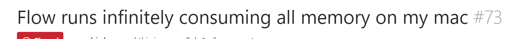
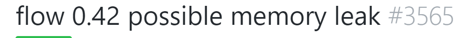

# Playing with types in React

---

# What options are there?

---

1. PropTypes
2. Flow <!-- .element: class="fragment" -->
3. Typescript <!-- .element: class="fragment" -->
4. More??? <!-- .element: class="fragment" -->

---

# Flow? 

---

 
 <!-- .element: class="fragment" -->
 <!-- .element: class="fragment" -->

---

Let's start with typescript.

```bash
yarn global add tsc
```

```bash
npm add -g tsc
```

---

### Some Code:

```js
function greet(person) {
  return `Hello, ${person}.`;
}

const user = 'John';

const output = greet(user);

console.log(output);
```

```
tsc <file.ts>
```

```
tsc ~/code/presentations/tsx/src/scratch/doc.ts
```

---

Let's switch gears slightly and see how this can help in React.

---

Luckily there's a way to bootstrap _create-react-app_ with typescript to make our lives easier.

```bash
create-react-app tsx --scripts-version=react-scripts-ts
```
---

Lets start with a functional component:

```js
import * as React from 'react';

const FunctionalComponent = () => (
  <div />
);

export default FunctionalComponent;
```

---

Now a stateful component: 

```js
import * as React from 'react';

class StatefulComponent extends React.Component {
  increment = () => {
    // const { counter } = this.state;
    // this.setState({ counter: counter + 1});
  }

  decrement = () => {
    // const { counter } = this.state;
    // this.setState({ counter: counter - 1});
  }

  render() {
    return (    
      <div>
        <span />
        {/* <button onClick={this.increment}>+</button>
        <button onClick={this.decrement}>-</button> */}
      </div>
    );
  }
}

export default StatefulComponent;
```

---

There's a ton more that you can rig up with Typscript, for instance typed state storage but I didn't quite have time to look into such things yet.

---
