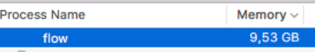

# Playing with types in React

---

# What options are there?

---

1. PropTypes <!-- .element: class="fragment" -->
2. Flow <!-- .element: class="fragment" -->
3. Typescript <!-- .element: class="fragment" -->
4. More??? <!-- .element: class="fragment" -->

---

Flow? 

---

 
 <!-- .element: class="fragment" -->
 <!-- .element: class="fragment" -->

---

Let's start with typescript.

---
